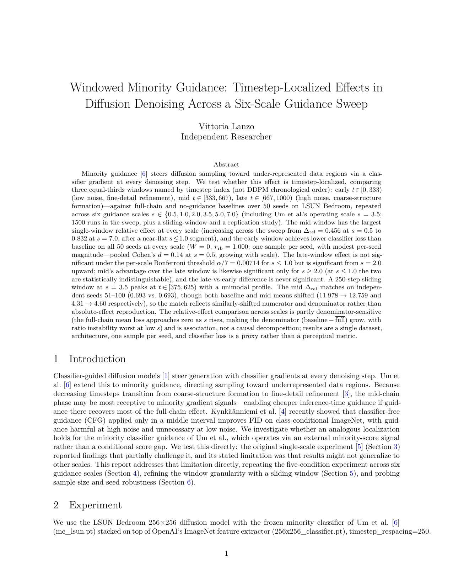
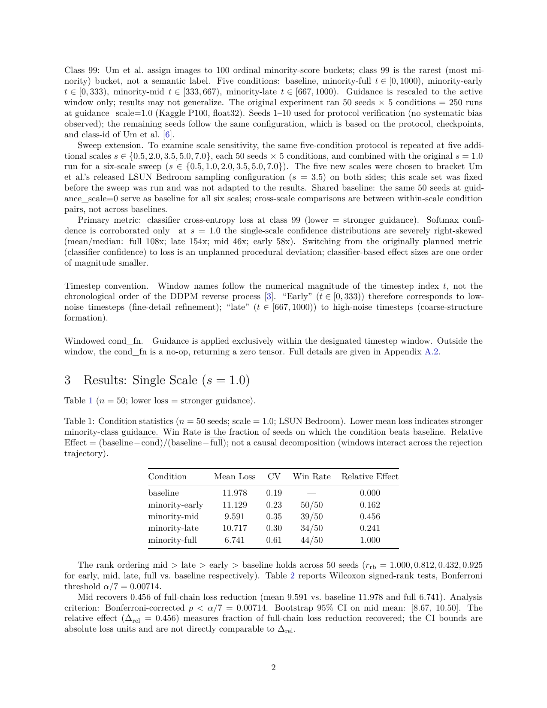
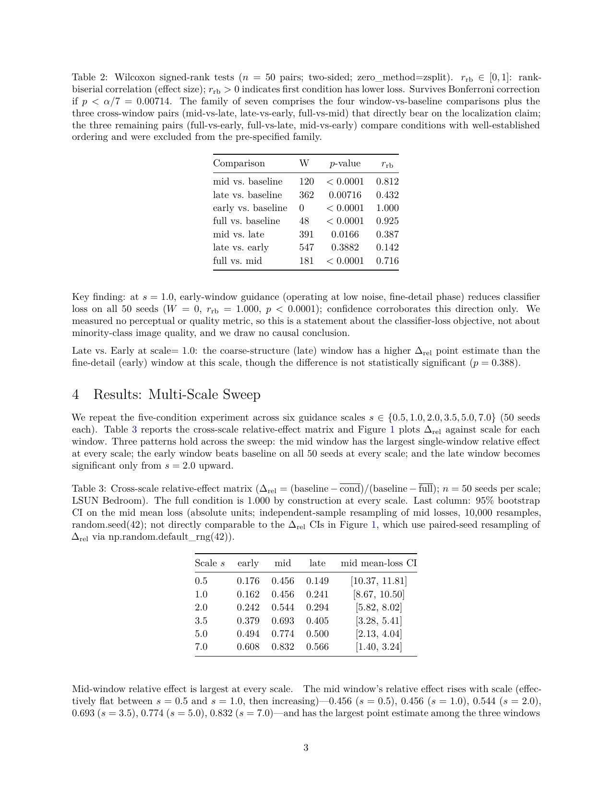
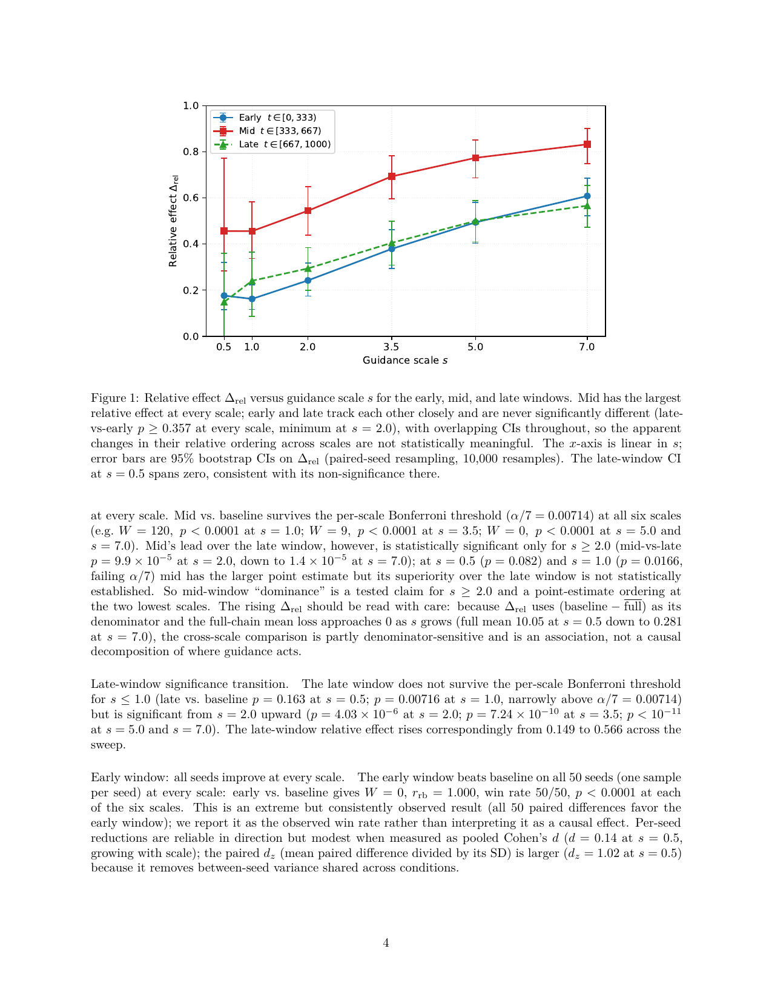
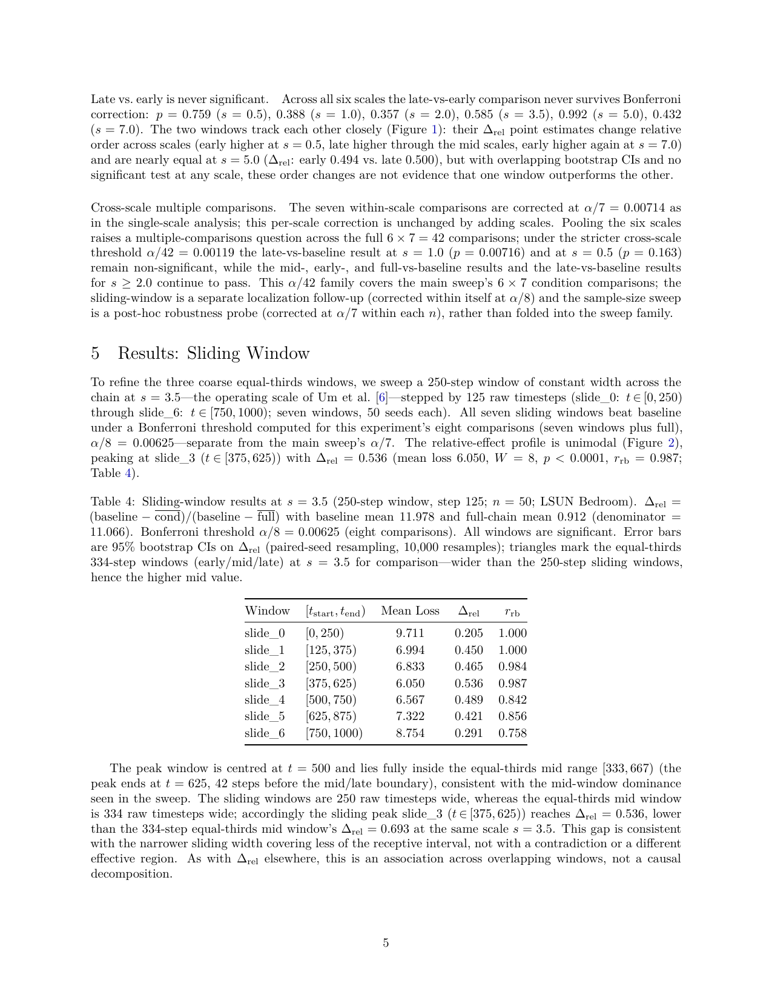
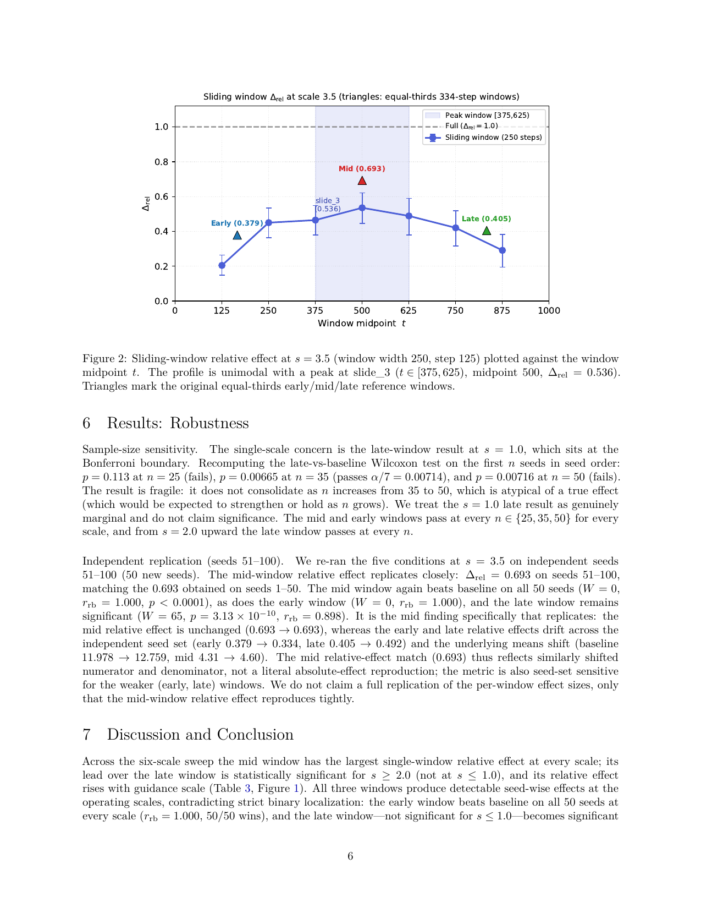
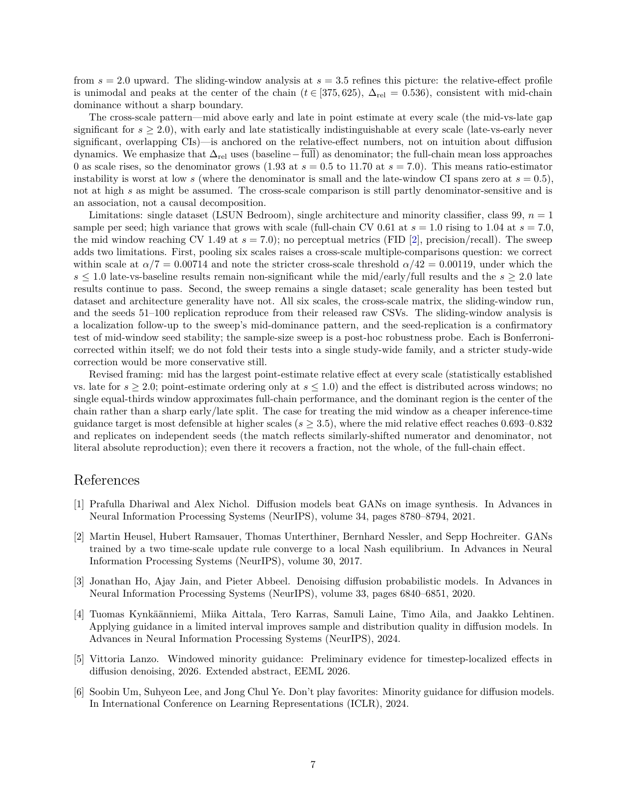
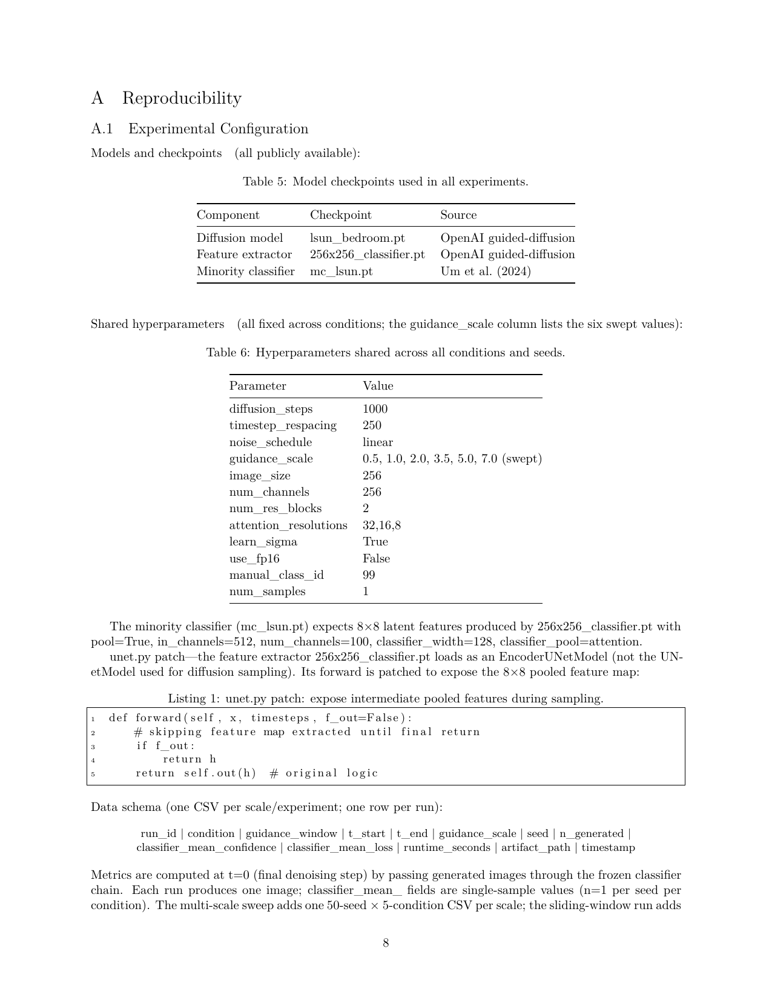
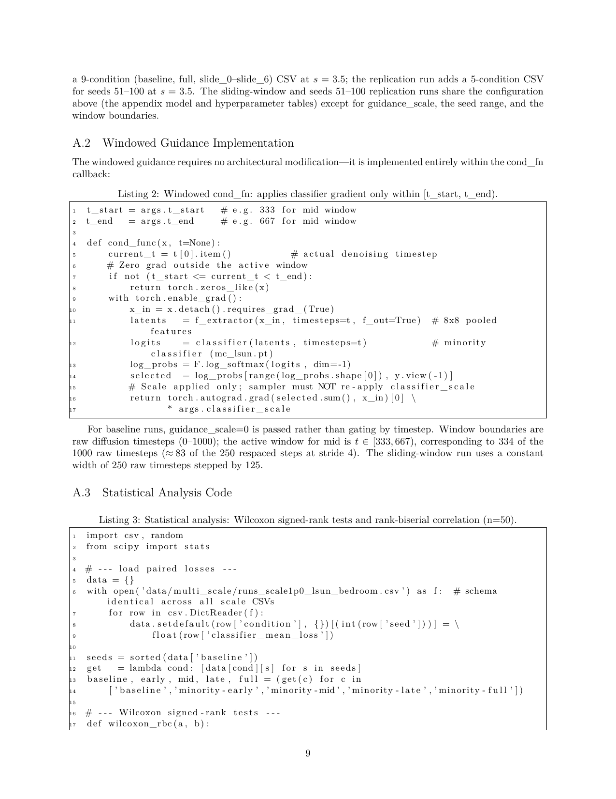
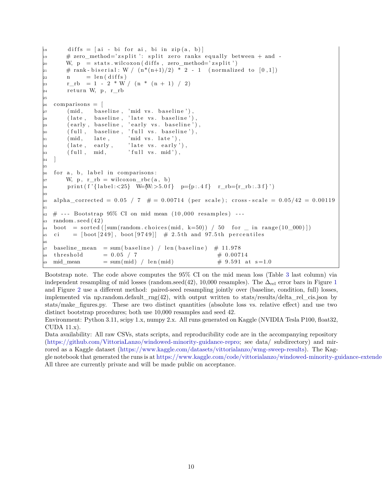

#Windowed Minority Guidance: Timesteps localized effects in diffusion denoising 

**Vittoria Lanzo** · Independent Researcher

*Extended report — companion to the extended abstract*

---

This report extends the single-scale (s=1.0) findings by sweeping guidance scale
across {0.5, 1.0, 2.0, 3.5, 5.0, 7.0} and adding a sliding-window localization experiment.
Mid-window (t∈[333,667)) dominance is confirmed at every scale (Δrel 0.456→0.832);
the late window becomes significant from s=2.0 upward; a 250-step sliding window at s=3.5
peaks at t∈[375,625) (Δrel=0.536, r_rb=0.987), refining the localization claim.

---

> **Timestep convention.** Window names follow the **numerical magnitude of the timestep index t**,
> not the chronological order of the DDPM reverse process. "Early" (t∈[0,333)) corresponds to
> low-noise timesteps (fine-detail refinement); "late" (t∈[667,1000)) to high-noise timesteps
> (coarse-structure formation).
>
> | Window | t range | Noise level | Denoising phase |
> |--------|---------|-------------|-----------------|
> | early  | [0, 333)    | low          | fine-detail refinement |
> | mid    | [333, 667)  | intermediate | semantic layout        |
> | late   | [667, 1000) | high         | coarse structure       |

---

## Cross-scale relative effects

| Scale | Early Δrel | Mid Δrel | Late Δrel | Late sig. |
|-------|-----------|---------|---------|----------|
| 0.5   | 0.176 | 0.456 | 0.149 | ✗ |
| 1.0   | 0.162 | 0.456 | 0.241 | ✗ |
| 2.0   | 0.242 | 0.544 | 0.294 | ✓ |
| 3.5   | 0.379 | 0.693 | 0.405 | ✓ |
| 5.0   | 0.494 | 0.774 | 0.500 | ✓ |
| 7.0   | 0.608 | 0.832 | 0.566 | ✓ |

Δrel = (baseline − cond) / (baseline − full); Bonferroni α/7 = 0.00714 per scale.
Early window achieves W=0 (all 50 seeds improve vs baseline) at every scale.

---

## Paper












📄 [WMG.draft.pdf](./paper/WMG.draft.pdf) · [WMG.draft.tex](./paper/WMG.draft.tex) (LaTeX source)

---

## Reproduce

### Data

All raw CSVs are in `data/` (one file per experiment):

```
data/multi_scale/     runs_scale{0p5,1p0,2p0,3p5,5p0,7p0}_lsun_bedroom.csv  (250 rows each)
data/sliding_window/  runs_sliding_window_lsun.csv                           (450 rows)
data/robustness/      runs_scale3p5_seeds51_100_lsun.csv                     (250 rows)
```

Mirrored at [vittorialanzo/wmg-sweep-results](https://www.kaggle.com/datasets/vittorialanzo/wmg-sweep-results) (public on acceptance).

### Re-run all stats from CSVs

```bash
pip install scipy numpy pandas matplotlib  # all stats scripts; no GPU required

python stats/compute_stats.py    # per-scale + cross-scale Wilcoxon, CIs
python stats/sliding_stats.py    # sliding-window stats
python stats/robustness_stats.py # seeds 51-100 replication
python stats/sensitivity.py      # n=25/35/50 sample-size sensitivity
python stats/skewness.py         # confidence skewness diagnostic (s=1.0)
python stats/make_figures.py     # regenerate figures with bootstrap CI error bars
python stats/audit.py            # verify all JSONs match CSVs (should print PASS)
```

All scripts write JSON to `stats/results/` and read from `data/`. Run from repo root.

### Kaggle notebooks

The runs were generated on Kaggle (NVIDIA Tesla P100, float32):

| Notebook | Description |
|----------|-------------|
| [windowed-minority-guidance-extended](https://www.kaggle.com/code/vittorialanzo/windowed-minority-guidance-extended) | Multi-scale sweep (all 6 scales) |
| [wmg-sliding-window](https://www.kaggle.com/code/vittorialanzo/wmg-sliding-window) | Sliding-window analysis at s=3.5 |
| [windowed-minority-guidance-experiment](https://www.kaggle.com/code/vittorialanzo/windowed-minority-guidance-experiment) | Original s=1.0 experiment |

Notebooks are currently private and will be made public on acceptance.

---

## Repository structure

```
data/
  multi_scale/            6 CSVs — one per guidance scale (0.5–7.0)
  sliding_window/         Sliding-window analysis at scale=3.5
  robustness/             Seeds 51–100 replication at scale=3.5

stats/
  compute_stats.py        Per-scale + cross-scale Wilcoxon, Bonferroni, CIs
  sliding_stats.py        Sliding-window Wilcoxon + Bonferroni
  robustness_stats.py     Seeds 51–100 replication stats
  sensitivity.py          Sample-size sensitivity (n in {25, 35, 50})
  skewness.py             Confidence mean/median skewness diagnostic
  make_figures.py         Figures with 95% bootstrap CI error bars
  audit.py                Blind math gate — verifies all JSONs against CSVs
  results/                Pre-computed JSON outputs (all reproducible from CSVs)

paper/
  WMG.draft.tex           LaTeX source
  WMG.draft.pdf           Compiled paper
  references.bib          Bibliography
  fig1_relative_effects.{pdf,png}   Cross-scale Delta_rel figure
  fig2_sliding_window.{pdf,png}     Sliding-window figure

figures/                  Figure copies (same as paper/fig*)

experiment/
  windowed_classifier_sample.py    Core WMG sampler (windowed cond_fn)
  run_experiment.py                Experiment runner
  extract_metrics.py               Classifier metric extraction from .npz
  guided_diffusion/                Diffusion library (from minority-guidance)

kaggle/
  windowed-minority-guidance-extended.ipynb   Multi-scale sweep kernel
  wmg-sliding-window.ipynb                    Sliding-window kernel
  NOTEBOOKS.md                                Kernel catalog
```

---

## Keywords

windowed minority guidance, classifier-guided diffusion, guidance scale sweep,
timestep localization, DDPM, LSUN Bedroom, sliding window, Wilcoxon, rank-biserial

---

## Citation

```bibtex
@misc{lanzo2026wmg_extended,
  title  = {Windowed Minority Guidance: Scale Sweep and Temporal Localization},
  author = {Vittoria Lanzo},
  year   = {2026},
  url    = {https://github.com/VittoriaLanzo/windowed-minority-guidance-repro}
}
```

## References

```bibtex
@inproceedings{um2024minority,
  title     = {Don't Play Favorites: Minority Guidance for Diffusion Models},
  author    = {Soobin Um and Suhyeon Lee and Jong Chul Ye},
  booktitle = {International Conference on Learning Representations},
  year      = {2024},
  url       = {https://openreview.net/forum?id=3NmO9lY4Jn}
}

@inproceedings{kynkaanniemi2024interval,
  title     = {Applying Guidance in a Limited Interval Improves Sample and
               Distribution Quality in Diffusion Models},
  author    = {Tuomas Kynkaanniemi and Miika Aittala and Tero Karras and
               Samuli Laine and Timo Aila and Jaakko Lehtinen},
  booktitle = {Advances in Neural Information Processing Systems},
  year      = {2024},
  url       = {https://arxiv.org/abs/2404.07724}
}

@inproceedings{dhariwal2021diffusion,
  title     = {Diffusion Models Beat {GAN}s on Image Synthesis},
  author    = {Prafulla Dhariwal and Alexander Nichol},
  booktitle = {Advances in Neural Information Processing Systems},
  year      = {2021}
}

@inproceedings{ho2020ddpm,
  title     = {Denoising Diffusion Probabilistic Models},
  author    = {Jonathan Ho and Ajay Jain and Pieter Abbeel},
  booktitle = {Advances in Neural Information Processing Systems},
  year      = {2020}
}
```
